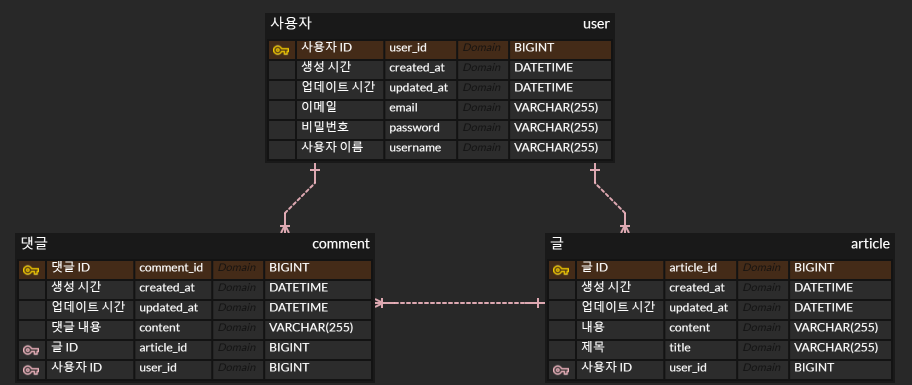

구체적인 프로그램 설계, 예외 상황과 테스트 케이스, 구현 결과에 대한 스크린샷 등의 세부사항은 "**결과보고서**"를 확인하시길 바랍니다.

# About

---

본 프로젝트는 유어슈 백엔드 지원 과제로서 수행한 간단한 블로그 만들기 프로젝트입니다.

Spring core, Spring boot, Spring mvc, JPA, Mysql, Slf4j, Junit 등을 사용하여 개발했습니다.

# ERD

---

ERD는 아래와 같습니다.

# API 설계

---

API 설계는 아래와 같습니다.

> **/users** 
> POST : 회원가입
> 
> **/users/login** 
> POST : 로그인
> 
> **/users/logout** 
> GET : 로그아웃
> 
> **/users/{userId}** 
> DELETE : 회원 탈퇴. 관련 게시물, 댓글 삭제
> 
> **/posts** 
> POST : 게시글 등록
> 
> **/posts/{articleId}** 
> PUT : 게시글 수정 
> DELETE : 게시글, 관련 댓글 삭제
> 
> **/posts/{articleId}/comments** 
> POST : 댓글 등록
> 
> **/comments/{commentId}** 
> PUT : 댓글 수정 DELETE : 댓글 삭제

# 패키지 구성

---

프로젝트의 핵심 코드는 src.main.java.springproject.urssublog에 있고, 해당 위치에서의 패키지 구성은 아래와 같습니다.

> controller : 각 도메인 별 controller 클래스가 있습니다.
> 
> service : 각 도메인 별 service 클래스가 있습니다.
> 
> repository : 각 도메인 별 repository 클래스가 있습니다.
> 
> domain : 각 도메일 별 엔티티 클래스가 있습니다.
> 
> dto : 요청/응답 처리 시에 사용하는 DTO 클래스가 있습니다.
> 
> exception : 사용자 정의 예외와, 예외 처리 클래스가 있습니다.
> 
> filter : 필터 관련 클래스들이 있습니다.
